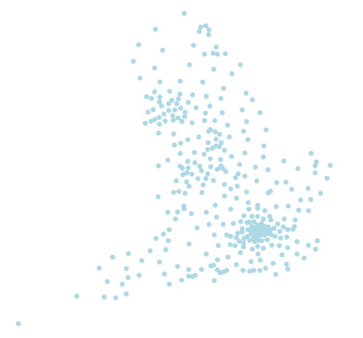
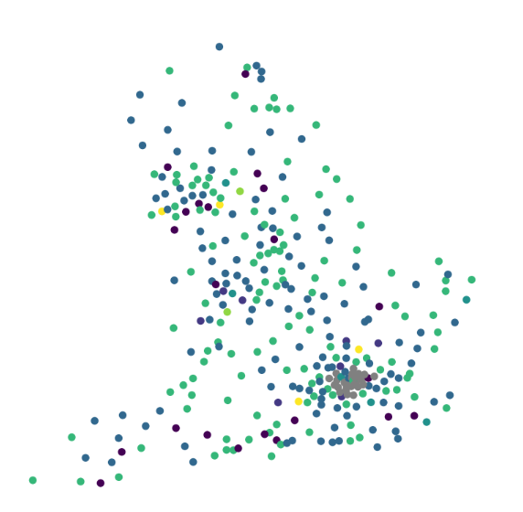
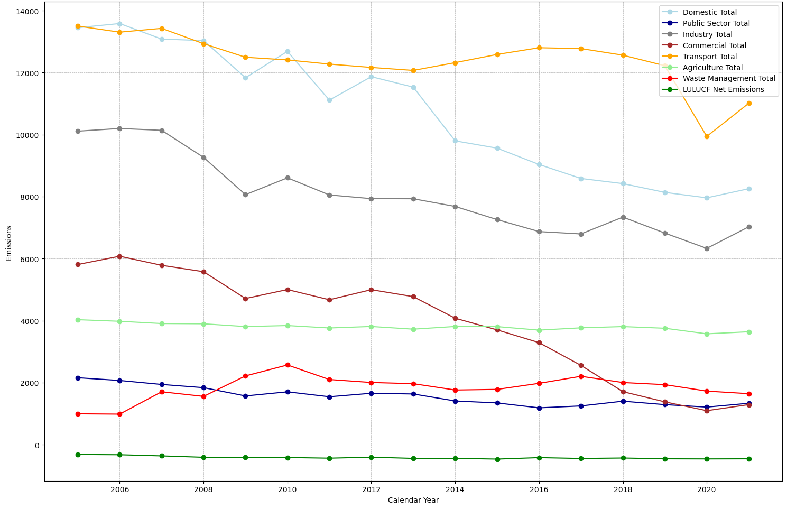
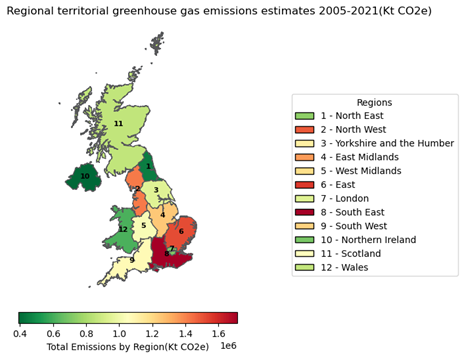
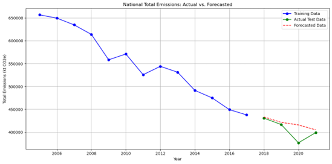

# Carbon Footprint Data Analysis

Welcome to my Carbon Footprint Data Analysis GitHub Page! Here, I explore how Data Analytics is making a difference in Decarbonization and Emission Reduction. This project aims to present a data-driven approach to analyzing carbon emissions. It includes time series forecasting with GRU (Gated Recurrent Unit) models, as well as geographical data analysis and community detection using network analysis methods.

There is an old saying that a problem well-defined is already half solved. Hence, I'll start by cleaning the data and simply graphing it to visually observe the nature of the underlying pattern.

## Features

- Graph of Local Authorities in Regions Based on Geographic Proximity.

- Graph of Local Authorities in Regions Based on Geographic Proximity Gaussian Mixture Models Clusters.

  
- Plot of Various emission sources and trends over time.

- Map of total Emission by region.

- Time series forecasting with GRU (Gated Recurrent Unit) models.

  
- Emissions Data Clusters of KMeans, DBScan, Gaussian Mixture Models visualization 

	

## Quick Start

Get up and running with Carbon footprint analysis in just a few steps:

1. Step one: load the dataset into a pandas dataframe
2. Step two: Clean the date, filter out duplicates
3. Step three: Implement the various algorithms

For detailed setup instructions, visit our [Installation Guide](/installation).

## Contribution

Interested in contributing? I love your enthusiasm! Check out my [Contribution Guidelines](/contributing) for more information.

## License

Carbon Footprint Data Analysis is made available under the [MIT License](/license).
